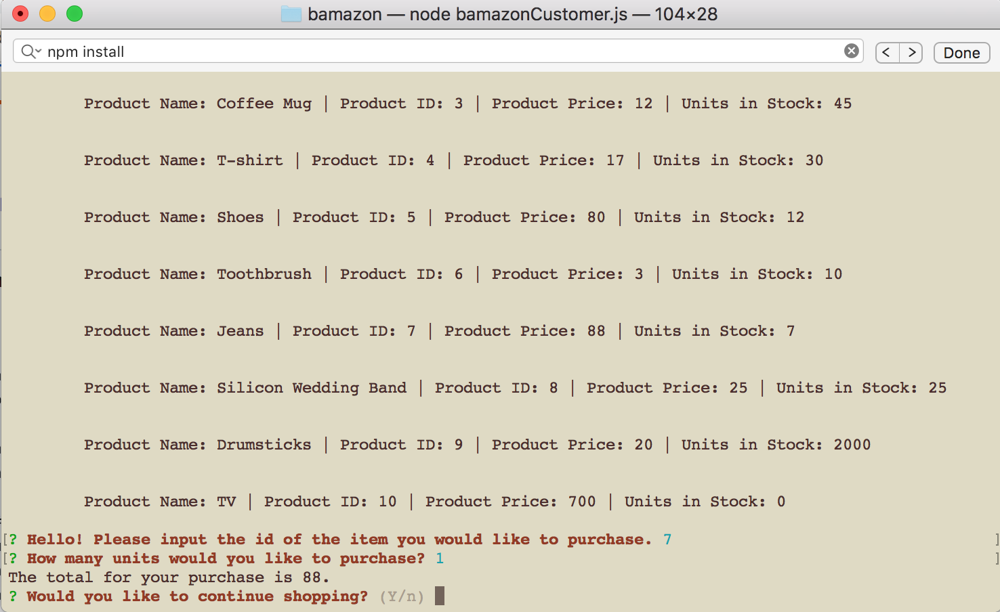

# bamazon

This is a storefront node application that utilizes itmes in a Mysql table. As items are purchased in the storefront, the number of units in stock are
updated in the Mysql table.

The application was built as part of the October-February coding bootcamp at UT Austin. The application was built using inquirer and Mysql npm 
packages, Javascript, and Mysql.

### How to use
Running the application is pretty self explanatory due to inquirer prompts. Upon prompting, simply select the id of an item you wish to buy
based on the selection shown. Then you will be prompted to enter the number of items you want to purchase. You will be shown the order total,
and asked if you would like to continue shopping. If so, you will see an updated list of products and inventory.

